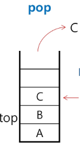

# Stack
물건을 쌓아 올리 듯 자료를 쌓아 올린 형태의 자료구조
- 선형 구조
    - 자료 간 관계 = 1:1
    - 비선형 구조 : 1:N
        - 트리
- 자료 삽입, 자료 꺼내기 가능
> 후입선출(LIFO, Last-In-First-Out)
> 
> 마지막에 삽입한 자료를 가장 먼저 꺼냄
    
## 스택을 프로그램에서 구현하기 위해 필요한 자료구조와 연산
### 자료구조
자료를 선형으로 저장할 저장소
- 배열
- 저장소 자체를 스택이라 부르기도
- 마지막 삽입된 원소 위치 = top
    - stack pointer: SP
    -  맨 위, 맨 오른쪽
### 연산
- `push`삽입: 저장소에 자료 저장
- `pop`삭제: 저장소에서 자료 꺼낸다. 삽입의 역순
- `isEmpty`: 공백인지 아닌지
- `peek`: top에 있는 item(원소)을 반환

1. `push A` 
top에 A 저장
2. `push B`
top에 B 저장
3. `push C`
top에 C 저장
4. `pop`
top에 있던 C 삭제
   

### stack의 구현
#### `push` algorithm
```python
def push(item):
    s.append(item)  # 어펜드 메서드 느림
```

```python
def push(item, size):
    global top
    top += 1
    if top == size:
        print('overflow!')  #디버깅용-> 더 큰 스택을 만들어야겠군
    else:
        stack[top] = item
size = 10
stack = [0] * size
top = -1

push(10, size)
top += 1            # push(20)
stack[top] = 20     #
```
#### `pop` algorithm
```python
def pop():
    if len(s) == 0:
        #underflow
        return
    else:
        return s.spop()
```
```python
def pop():
    global top
    if top == -1:
        print('underflow')
        return 0
    else:
        top -= 1
        return stack[top+1] #실제로 지워진다는 개념은 없다.

print(pop())

if top == -1:
    top -= 1
    print(stack[top+1])
```

### 고려사항
- 1차원 배열을 사용한 구현
    - 구현이 쉽다
    - 스택의 크기 변경이 어렵다
- 동적 구현
    - 동적 연결리스트 이용하는 것
    - 구현이 복잡함
    - 메모리를 효율적으로 사용
  
## 응용
- 괄호의 종류: 대괄호[], 중괄호{} 소괄호()
- 조건
  1. 왼쪽, 오른쪽 괄호의 개수가 같아야 한다.
  2. 같은 괄호에서 왼쪽이 오른쪽보다 먼저
  3. 괄호 사이는 포함 관계만 존재
  
### 괄호 검사
- 문자열의 괄호 검색
- 순회하며 왼쪽 괄호를 저장한다.
- 오른쪽 괄호를 만나면 pop하여 비교
- 오류!
  - 마지막에 괄호가 남아있으면
  - pop을 해야 하는데 없으면
     