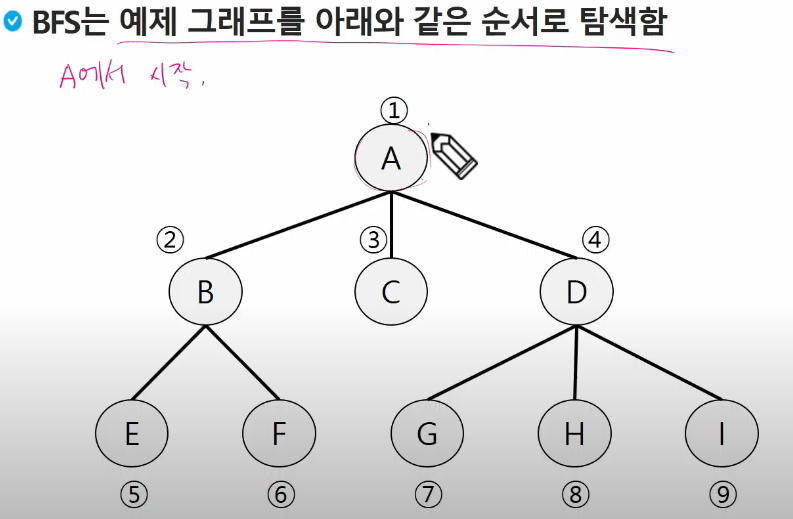

# BFS
> Breadth First Search 너비 우선 탐색
> 
> 탐색 시작점의 인접한 정점을 모두 차례로 방문하고
> 방문했던 정점을 시작점으로 하여 다시 인접한 정점들을 차례로 방문하는 방식

1.  A를 처리하며 인접한 정점들을 조사해서 대기시킴
2. 대기시킨 것들 처리하면서 인접한 정점들 조사해서 대기시킴
   
    대기 순서[B, C, D, |E, F, |G, H, I]
   
### 일방향일 때
### 위의 그래프에서 B-C가 연결되어 있는 경우
- enQueue(인큐)와 visited(비지티드, 처리)를 동시에 하는 걸 추천
   
   = 큐에 enQueue 되었음을 표시
  